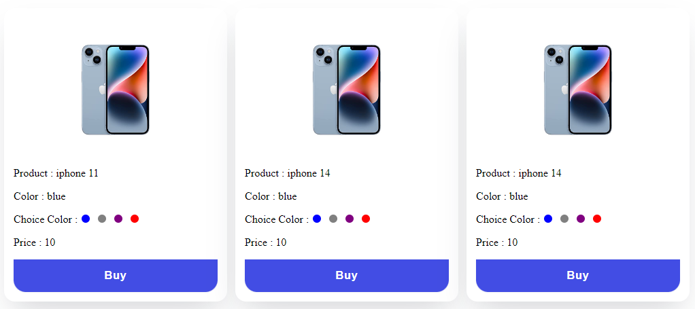

## Available Scripts

In the project directory, you can run:

project installation

### `npm i --legacy-peer-deps`

### `npm start`

Runs the app in the development mode.\
Open [http://localhost:3000](http://localhost:3000) to view it in your browser.

image.png

